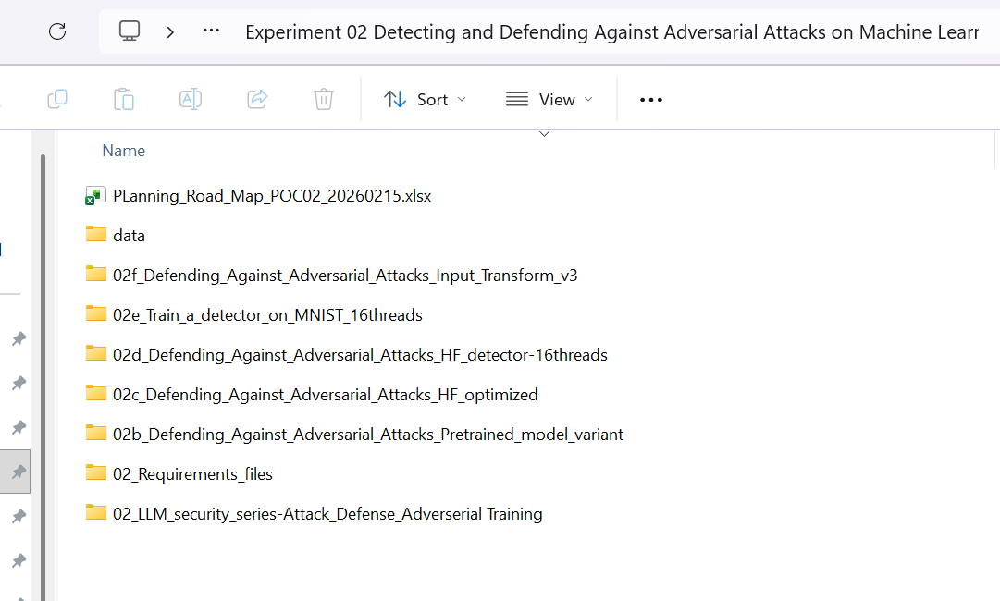
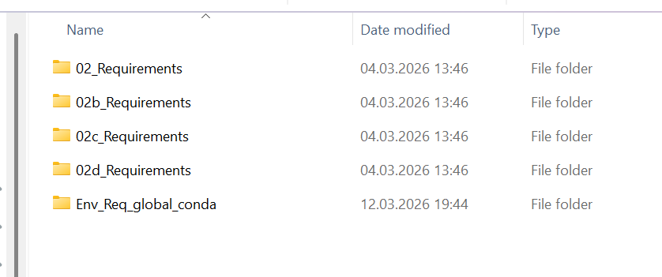

<p align="center">
  ⭐ <b>If you find this work useful, consider starring the repository!</b>
</p>

<h1 align="center">Adversarial Attacks & Defenses on Machine Learning Models</h1>

<p align="center">
  
</p>

<p align="center">
  <b>Understanding how models break under adversarial perturbations — and how to defend them</b>
</p>

---

## Overview

This parent folder groups the full Experiment 02 series dedicated to **adversarial attacks and defenses on machine learning models**.

The goal is to study how small perturbations can:

- degrade accuracy
- mislead predictions
- reveal hidden vulnerabilities
- challenge the reliability of defense mechanisms

This experiment series covers both **offensive techniques** and **defensive strategies**, from adversarial sample generation to detector evaluation and input transformation defenses.

---

## Environment

Before running the notebooks, activate the shared conda environment:

```bash
conda activate Env_Req_global_conda
```

This environment is the recommended starting point for the full Experiment 02 series.

---

## Experiments Covered

This folder includes several complementary experiments:

- **02b** — pretrained model variant
- **02c** — adversarial attacks with an optimized Hugging Face pipeline
- **02d** — detector-based defense evaluation
- **02e** — training a detector on MNIST
- **02f** — input transformation defense

Together, these notebooks explore the full workflow:

1. generate adversarial samples  
2. measure accuracy degradation  
3. evaluate detector performance  
4. test defense strategies under attack  

---

## Visual Evidence

### Clean vs adversarial example

<p align="center">
  
  
</p>

A visually similar image can lead to a different prediction once adversarial perturbations are introduced.

---

### Robustness curve

<p align="center">
  
</p>

Accuracy decreases as perturbation strength increases, even when basic defenses are applied.

---

### Detector performance

<p align="center">
  
</p>

Detection helps identify adversarial samples, but performance varies significantly depending on the attack family.

---

## Key Insight

> Models may remain highly confident while being fundamentally vulnerable to adversarial intent.

Adversarial robustness is not only about maintaining accuracy on clean data.  
It is about understanding how models behave when inputs are intentionally manipulated.

---

## Folder Structure

```text
Experiment 02/
├── 02b_Pretrained_model_variant/
├── 02c_Defending_Against_Adversarial_Attacks_HF_optimized/
├── 02d_Defending_Against_Adversarial_Attacks_HF_detector/
├── 02e_Train_a_detector_on_MNIST_16threads/
├── 02f_Input_Transform/
├── 02_Requirements_files/
├── data/
└── README.md
```

---

## Author

Natacha Bakir  
AI Security Researcher | Malware Reverse Engineering | Threat Intelligence
