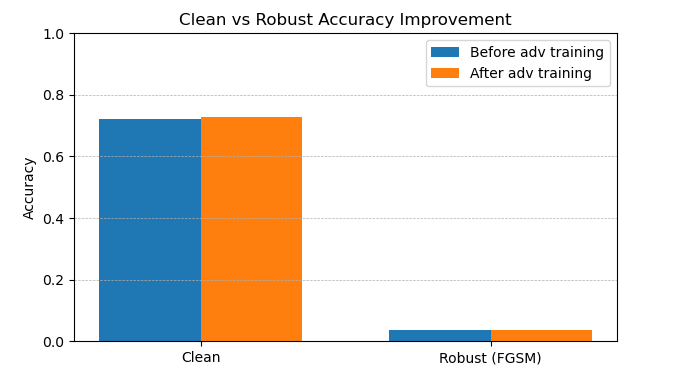
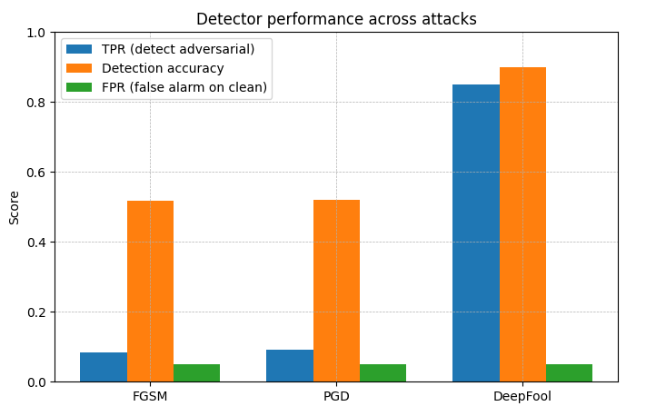

<p align="center">
  ⭐ <b>If you find this work useful, consider starring the repository!</b>
</p>

<h1 align="center">Adversarial Attacks & Defenses on Machine Learning Models</h1>

<p align="center">
  
</p>

---

## Overview

This parent folder groups the full Experiment 02 series dedicated to adversarial attacks and defenses.

---

## Environment

```bash
conda activate Env_Req_global_conda
```


### Robustness curve

<p align="center">
  
</p>

Accuracy decreases as perturbation strength increases.

---

### Defense impact

<p align="center">
  
</p>

Adversarial training slightly improves robustness.

---

### Detector performance

<p align="center">
  
</p>

Detection helps but remains imperfect.

---

## Key Insight

Models are robust to noise but fragile to adversarial intent.

---

## Author

Natacha Bakir
