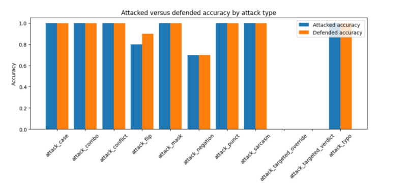

# When Meaning Breaks AI

<p align="center">
  
</p>

<p align="center">
  <b>Adversarial sentiment analysis experiment with Hugging Face</b><br>
  Robust to noise. Fragile to meaning.
</p>

<p align="center">
  
  
  
  
</p>

---

## Overview

This experiment shows how a sentiment analysis model can achieve perfect accuracy on clean inputs while remaining vulnerable to semantic adversarial attacks.

The key result is simple:

- surface noise has little effect
- weak semantic perturbations destabilize confidence
- targeted semantic overrides can fully flip predictions
- preprocessing helps against noise, but fails against meaning manipulation

This notebook is part of a broader AI Security experimentation track focused on adversarial robustness, prompt injection, RAG hijacking, and defensive evaluation.

---

## Why this experiment matters

Sentiment analysis is often treated as a lightweight NLP task. In practice, it is frequently used inside real workflows such as:

- customer support triage
- complaint prioritization
- content moderation
- brand and financial monitoring

When model outputs influence downstream decisions, semantic manipulation becomes a real attack surface.

An attacker does not need to break the model architecture. It is often enough to control how meaning is expressed in the input.

---

## Research question

This experiment investigates one central question:

> What happens when meaning, not syntax, is manipulated?

To answer it, we test a Hugging Face RoBERTa based sentiment classifier against several attack families and then measure whether a simple preprocessing defense can recover robustness.

---

## Model and setup

We use:

- `cardiffnlp/twitter-roberta-base-sentiment-latest`
- a small, fully interpretable sentiment dataset
- a progressive attack strategy from surface perturbations to strong semantic overrides

The experiment is designed to remain easy to inspect manually while still exposing realistic failure modes.

---

## Attack progression

### 1. Surface level perturbations

These attacks preserve meaning while modifying text form:

- typos
- punctuation noise
- casing changes
- partial masking

**Result:** predictions stay correct.  
**Interpretation:** the model is robust to noise.

### 2. Weak semantic perturbations

These attacks introduce ambiguity or contradiction:

- negation
- sentiment conflict
- sentiment injection

**Result:** labels do not always flip, but confidence drops sharply.  
**Interpretation:** the model becomes unstable before it fails.

### 3. Targeted semantic overrides

These attacks inject clear and dominant sentiment signals:

- targeted override
- targeted verdict

**Result:** predictions flip with high confidence.  
**Interpretation:** the model is vulnerable to meaning manipulation.

---

## Defense strategy

A lightweight preprocessing layer is applied before inference:

- lowercasing
- punctuation cleanup
- typo correction
- pattern normalization

This improves robustness against formatting noise, but does not solve the semantic problem.

---

## Results

The chart below compares attacked versus defended accuracy across attack types.

<p align="center">
  
</p>

### Main observations

- surface attacks remain near perfect
- weak semantic attacks reduce performance and confidence
- targeted semantic attacks drop attacked accuracy to `0.0`
- preprocessing only slightly improves overall accuracy
- targeted attacks remain successful even after defense

### Global metrics

- clean accuracy: `1.00`
- attacked accuracy: `~0.77`
- defended accuracy: `~0.78`

The gain from preprocessing is marginal. The core vulnerability remains unchanged.

---

## Security takeaway

This experiment highlights a critical limitation of preprocessing based defenses in NLP systems.

Preprocessing can clean noise, but it cannot understand intent, resolve contradictions, or detect adversarial semantics. As a result, it offers only superficial robustness.

The central lesson is:

> NLP systems are not vulnerable because of noise.  
> They are vulnerable because they do not fully capture meaning.

---

## Connection to LLM security

Although this notebook focuses on sentiment analysis, the same logic extends to modern LLM systems.

The underlying weakness appears again in:

- prompt injection
- RAG hijacking
- instruction overriding
- context poisoning

In all of these cases, the problem is not simply malformed text. The problem is semantic control.

---

## Repository structure

```text
03a_Evasion_Attack_Sentiment_Analysis_HuggingFace.ipynb
README.md
attack_vs_defense.png
```

---

## Reproduce the experiment

Clone the repository and open the notebook:

```bash
git clone https://github.com/Alphabot42/AI-Security
cd AI-Security
```

Then run:

```text
03a_Evasion_Attack_Sentiment_Analysis_HuggingFace.ipynb
```

Recommended environment:

- Python 3.x
- transformers
- torch
- pandas
- matplotlib
- huggingface_hub

---

## Highlights

- clear progression from robustness to instability to failure
- interpretable attack examples
- visual comparison of attacked versus defended accuracy
- direct bridge between adversarial NLP and LLM security
- practical notebook for reproducible AI security experimentation

---

## Author

**Natacha Bakir**  
Cyber Threat Intelligence Lead | Malware Reverse Engineer | AI Security Research

GitHub: [Alphabot42](https://github.com/Alphabot42)

---

## Related work in this series

- Experiment 01: Adversarial Examples in Practice
- Experiment 02: Defending Against Adversarial Attacks
- Experiment 03a: Evasion Attack on Sentiment Analysis with Hugging Face
- Experiment 03b: Evasion Attack on Sentiment Analysis with Local Llama
- Experiment 04: Prompt Injection and RAG Hijacking
