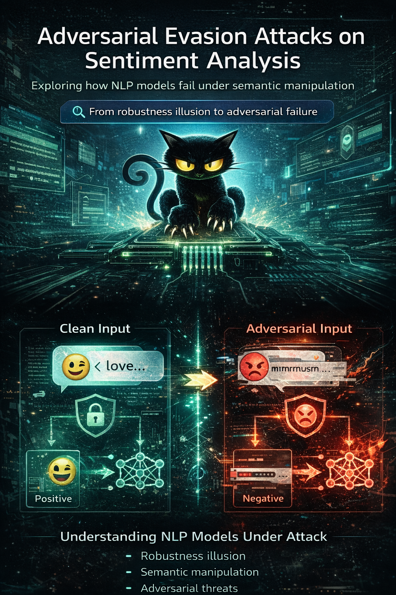

  ⭐ <b>If you find this work useful, consider starring the repository!</b>

# Adversarial Evasion Attacks on Sentiment Analysis

  

  <b>Exploring how NLP models fail under semantic manipulation</b>

  🚨 From robustness illusion to adversarial failure

---

## Overview

This project is part of an AI Security research series focused on adversarial evasion attacks in NLP systems.

The goal is to understand how models behave when inputs are intentionally manipulated.

---

## Research Question

What happens when meaning — not syntax — is manipulated?

---

## Experiments

### 03a — Hugging Face Classifier
- Robust to noise
- Fragile to semantic manipulation

### 03b — LLM (coming soon)
- Same attacks applied to LLMs

---

## Key Insight

Models are robust to noise but fragile to meaning.

---

## Author

Natacha Bakir  
AI Security Researcher
