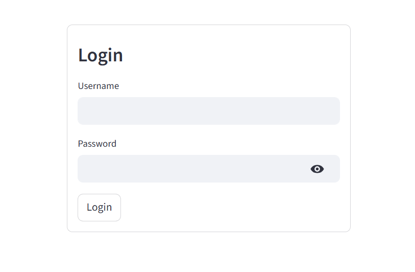
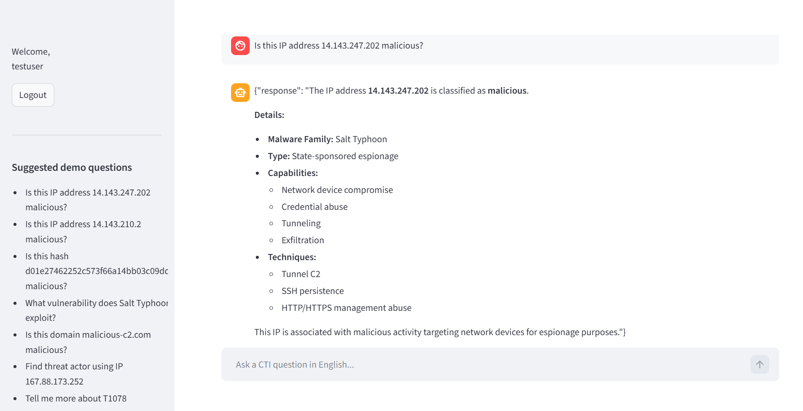

<p align="center">
⭐ <b>If you find this demo useful, consider starring the repository!</b>
</p>

# 🛡️ Secure AI CTI Assistant – Chatbot Demo (09B3)

---

## 🎯 Demo Overview

This project demonstrates a **secure, dataset-grounded AI chatbot for Cyber Threat Intelligence (CTI)**.

Unlike traditional AI assistants, this chatbot:

- ❌ Does NOT hallucinate  
- ❌ Does NOT invent data  
- ✅ Only answers from trusted CTI data  
- ✅ Refuses safely when information is missing  

👉 This is a **realistic CTI assistant demo for SOC analysts and security teams**.

---

## 🖥️ Interface Preview

### 🔐 Login Screen


---

### 💬 Chatbot Interface


---

### 🧪 Example Response


---

## 🎥 Demo Video

👉 Full demo:

```bash
video196300104.mp4
