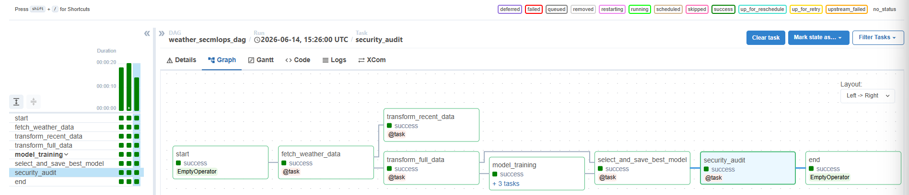

⭐ If you find this work useful, consider starring the repository!

# Experiment 13 SecMLOps Airflow Weather Pipeline

*SecMLOps weather pipeline orchestrated with Apache Airflow, including encrypted variables, runtime validation, model metadata, and a final security audit task.*

## Objective

This experiment turns an Airflow weather machine learning pipeline into a SecMLOps use case.

The pipeline collects weather data from OpenWeatherMap, stores raw JSON files, transforms the data into CSV files, trains several regression models, selects the best model, and saves it for reuse by a dashboard.

The enriched version adds security controls around secrets, data validation, model integrity, auditability, and reproducibility.

## Phase

Phase 4 Defense Systems

## OWASP AI Top 10 mapping

This experiment follows the repository existing OWASP AI Top 10 mapping.

| Risk | Why it matters here |
|---|---|
| LLM03 Training Data Poisoning | The model is trained from external weather data. The pipeline must validate inputs before training. |
| LLM06 Sensitive Information Disclosure | API secrets must not be hardcoded or pushed to GitHub. |
| LLM08 Excessive Agency | Airflow automates API calls, file creation, data transformation, training, model selection, and model persistence. These actions must be controlled and auditable. |

## Architecture

| Service | Role |
|---|---|
| Airflow webserver | Airflow UI |
| Airflow scheduler | DAG scheduling |
| Airflow worker | Task execution |
| PostgreSQL | Airflow metadata database |
| Redis | Celery broker |
| Dashboard | Weather dashboard exposed on port 8050 |

## DAG workflow

start  
fetch_weather_data  
transform_recent_data  
transform_full_data  
model_training  
select_and_save_best_model  
security_audit  
end

## Security controls

| Control | Description |
|---|---|
| Secret separation | OpenWeatherMap API key is loaded from an Airflow Variable. |
| City validation | City names are validated before API calls. |
| HTTP control | API status codes are checked. |
| Timeout | API calls use a timeout to avoid blocking the DAG. |
| JSON validation | Required weather fields are checked before transformation. |
| CSV validation | Empty generated datasets are rejected. |
| Model hash | The saved model is hashed with SHA256. |
| Model metadata | A metadata report is generated after model selection. |
| Security audit | Final task checks generated files and writes an audit report. |

## Repository structure

Experiment 13 SecMLOps Airflow Weather Pipeline

README.md  
SECURITY.md  
docker compose file  
variables.example.json  
dags/weather_secmlops_dag.py  
docs/ARCHITECTURE.md  
docs/THREAT_MODEL.md  
docs/SECURITY_CONTROLS.md  
screenshots  
sample_data/sample_data.csv  
sample_data/sample_fulldata.csv  

## Airflow Variables

Create the following Airflow Variables.

{
  "cities": ["zurich", "london", "washington"],
  "api_key": "replace_with_openweathermap_api_key"
}

The real API key must never be committed.

## Expected outputs

| File | Purpose |
|---|---|
| data.csv | Recent transformed weather data |
| fulldata.csv | Full transformed weather data |
| best_model.pickle | Selected model |
| model_metadata.json | Model name, score, features, hash and training metadata |
| security_audit.json | Final audit report |

Runtime files are ignored by Git.

## Status

Progress: 25 percent

The exam baseline is working. The SecMLOps enriched version adds model integrity and audit controls. Screenshots and article material will be added after validation.

## Runtime validation evidence

The enriched SecMLOps DAG was validated in Apache Airflow.

Validated points:

Fernet encryption configured for Airflow Variables.
OpenWeatherMap API key stored as an encrypted Airflow Variable.
OpenWeatherMap API test returned HTTP 200.
The full DAG completed successfully.
The final security_audit task generated security_audit.json.
The model metadata file contains the selected model name, score, features, training rows, and SHA256 hash.

Useful screenshots are available in the screenshots directory.
